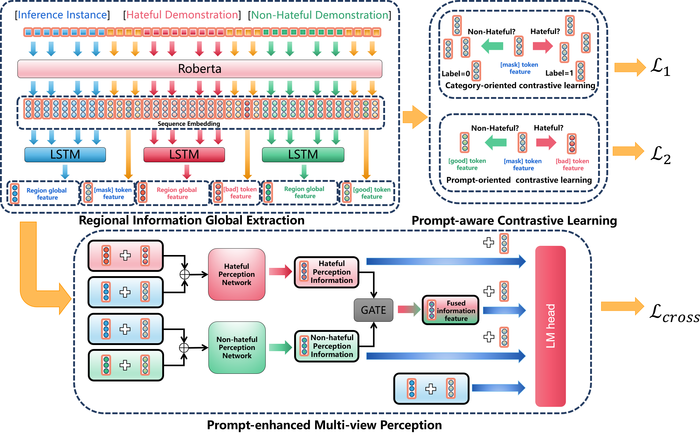

# Prompt-enhanced Network for Hateful Meme Classification
#### This is the source code of the Pen network framework. The paper has been accepted by the International Joint Conference of Artificial Intelligence (IJCAI)
### Overview of the Pen framework

Existing prompt method guides PLM in classification by providing demonstrations corresponding to each label. Given the demonstrations for each label, there should be specific feature-level connections in the feature space between the contextual information of inference instances and the contextual information corresponding to the demonstrations of their correct labels. Building upon this concept, we extend prompt method into the feature space, introducing a novel framework called the **P**rompt-**en**hanced network for hateful meme classification --- **Pen**).
# Run Pen code
cd Pen
pip install -r requirement.txt --extra-index-url https://download.pytorch.org/whl/cu113
bash run.sh
